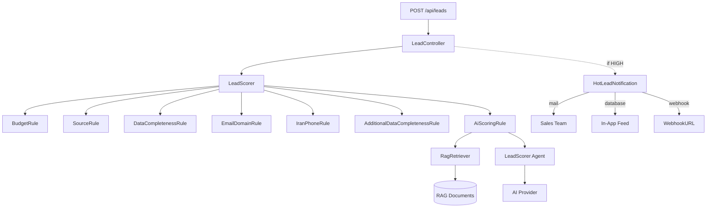

<p align="center">
  <picture>
    
  </picture>
</p>

<h1 align="center">Bimebazar Lead Management System</h1>

<p align="center">
  A Persian lead management platform built with <strong>Laravel 13</strong>, <strong>Livewire 4</strong>, and <strong>Flux UI</strong>.
  Features intelligent scoring, RAG-powered AI evaluation, and real-time notifications.
</p>

<p align="center">
  <a href="#-features">Features</a> •
  <a href="#-architecture">Architecture</a> •
  <a href="#-quick-start">Quick Start</a> •
  <a href="#-scoring-system">Scoring System</a> •
  <a href="#-testing">Testing</a>
</p>

<br>

## ✨ Features

<table>
<tr>
  <td align="center" width="33%"><strong>🔢 Intelligent Scoring</strong><br>7 modular rules including budget, source, email domain, Iranian phone validation, AI-powered semantic evaluation with RAG.</td>
  <td align="center" width="33%"><strong>🧠 AI-Powered Insights</strong><br>Uses <code>laravel/ai</code> SDK with configurable provider (OpenAI, Anthropic, Gemini, etc.). Synchronous AI scoring with contextual RAG retrieval.</td>
  <td align="center" width="33%"><strong>📢 Multi-Channel Notifications</strong><br>Database, email, and customizable webhook dispatch for hot leads. Queue-backed for reliability.</td>
</tr>
<tr>
  <td align="center" width="33%"><strong>📊 Flux UI Dashboard</strong><br>Livewire-powered dashboard with KPIs, filters, and inline lead creation. Clean sidebar navigation.</td>
  <td align="center" width="33%"><strong>🔄 Smart Upsert</strong><br>RESTful API endpoint with upsert on duplicate email or phone. At least one contact method required.</td>
  <td align="center" width="33%"><strong>📚 RAG Document Management</strong><br>Upload and manage scoring criteria documents with auto-generated embeddings for semantic context retrieval.</td>
</tr>
</table>

---

## 🏗 Architecture


---

## 🚀 Quick Start

### Prerequisites

- PHP 8.3+
- [Composer](https://getcomposer.org/)
- Node.js 20+ & npm
- SQLite (or MySQL/PostgreSQL)

### Setup

```bash
# 1. Clone the repository
git clone git@github.com:alibayat73/bimebazarShoraka.git
cd bimebazarShoraka

# 2. Install PHP dependencies
composer install

# 3. Install frontend dependencies
npm install

# 4. Environment configuration
cp .env.example .env
php artisan key:generate

# 5. Database setup (SQLite)
touch database/database.sqlite

# 6. Run migrations and seeders
php artisan migrate --seed

# 7. Start the dev server, queue worker, log watcher, and Vite hot-reload concurrently
composer run dev
```

The application will be available at **http://localhost:8000**.

### Default Credentials

After seeding, you can log in with:

```
Email:    test@example.com
Password: password
```

---
### AI Providers

The system supports 14+ AI providers via `laravel/ai`. Set the corresponding `*_API_KEY` in your `.env`:

- `ANTHROPIC_API_KEY` — Claude
- `GEMINI_API_KEY` — Google Gemini
- `DEEPSEEK_API_KEY` — DeepSeek
- `MISTRAL_API_KEY` — Mistral AI
- ... and more (see `config/ai.php`).

> **Without an API key**, AI scoring gracefully returns 0, and embedding generation is skipped. All other features work normally.

---

## 🧠 Scoring System

The scoring engine uses the **Strategy Pattern** — each rule is an independent class implementing `ScoringRuleInterface`. Rules are registered in `AppServiceProvider` and executed iteratively per lead.

### Priority Thresholds

| Priority   | Score Range | Action                           |
|------------|-------------|----------------------------------|
| **High**   | ≥ 35        | Hot lead notification dispatched |
| **Medium** | 15–34       | Standard lead                    |
| **Low**    | ≤ 14        | Low-priority lead                |

### Scoring Rules

| Rule                               | Max Score | Description                                                                  |
|------------------------------------|-----------|------------------------------------------------------------------------------|
| **BudgetRule**                     | 40        | 7 budget tiers + precision bonus + source alignment bonus                    |
| **SourceRule**                     | 20        | Source quality (partner_api=15, web=5, manual=3, csv=2) + contact bonus      |
| **DataCompletenessRule**           | 15        | Weighted field presence + consistency bonus + contradiction penalty          |
| **EmailDomainRule**                | 20        | edu/gov=20, corporate=15, premium=5, generic=0, disposable=-5                |
| **IranPhoneRule**                  | 11        | Operator detection (MCI/Irancell/Rightel) + length check + landline support  |
| **AdditionalDataCompletenessRule** | 9         | Weighted keys (job_title, company_size, industry, website) + multi-key bonus |
| **AiScoringRule**                  | 50        | AI-powered scoring with RAG context retrieval, agent-based evaluation        |

## 🧪 Testing

```bash
# Run all tests
php artisan test --compact

# Run a specific test file
php artisan test --compact tests/Feature/LeadIngestionTest.php

# Run a specific test method
php artisan test --compact --filter=test_can_ingest_a_lead_and_calculate_score
```
